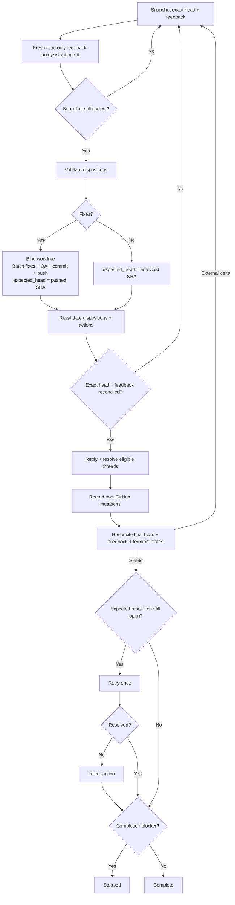

# PR Feedback Triage

Drive all current PR feedback for one exact head through analysis, focused fixes, replies, and thread resolution. Use the same procedure standalone or inside a larger PR loop.

## Invariants

- The top-level agent owns every repository and GitHub mutation; delegate feedback analysis only to one fresh independent read-only native subagent.
- Bind every disposition, fix, reply, and resolution to the exact PR head SHA and feedback snapshot used to decide it.
- The feedback-analysis subagent is a terminal leaf: no mutation, re-entry, or further delegation. If it causes Git-visible mutation, reject its output and stop before any fix, reply, or resolution.
- Require a finite caller- or runtime-enforced subagent deadline; otherwise report `unsupported` and stop. Do not retry ambiguously accepted work.
- Treat subagent output as advisory and validate it before acting.
- Keep changes scoped to feedback. Apply KISS, DRY, and YAGNI and preserve unrelated local work.

## Feedback Contract

Snapshot the exact head repository/ref/SHA and all current feedback. Paginate platform reads and preserve typed source IDs plus source-head provenance when available:

- `thread:<id>`: inline thread/comment, with original/review commit metadata when available;
- `comment:<id>`: PR-level comment, with source head when established, otherwise `none`;
- `review:<id>`: review submission with reviewer, persisted state, submission time, reviewed/source head SHA, and body;
- copied feedback: non-platform source.

Historical feedback remains in scope and must be revalidated against the current head. Split independent findings into stable item-scoped records while retaining parent source IDs; merge only the same root cause.

Require one disposition per distinct item: `fix`, `already addressed`, `outdated`, `answer`, `clarify`, `defer`, or `won't fix`. A `fix` includes the smallest concrete edit and verification; `defer` / `won't fix` include `decision_terminal: true|false`. Every item also includes source IDs, concise reply guidance or `none`, and `resolve`, `leave_open`, or `not_resolvable` for each source. Resolve a parent thread only when every contributing item is resolve-eligible.

## Flow

Ignore only this run's recorded GitHub mutations during reconciliation. Require exact head equality before replies or resolutions; ancestry is insufficient.

Resolve `defer` / `won't fix` only when `decision_terminal: true`; `clarify` and non-terminal decisions remain open.

An active `CHANGES_REQUESTED` review is `awaiting_re_review`. Explicit dismissal clears it; a later same-reviewer `APPROVED` clears it, a later same-reviewer `CHANGES_REQUESTED` replaces it as the active blocker, and `COMMENTED` does not supersede it. Do not dismiss reviewer state to clear it.

## Terminal States

Track every platform source as `resolved`, `replied_left_open`, `not_resolvable`, `awaiting_re_review`, or `failed_action`. `replied_left_open` is terminal only when its disposition is terminal.

Completion is blocked by unpublished fixes, missing clarification, non-terminal defer/won't-fix decisions, `awaiting_re_review`, failed actions, unresolved QA, or unreconciled head/feedback changes.

## Output

Report the analyzed/final head SHA, disposition counts, fixes and verification, replies/resolutions, terminal-state counts, and any remaining blocker or required reviewer/user action.
