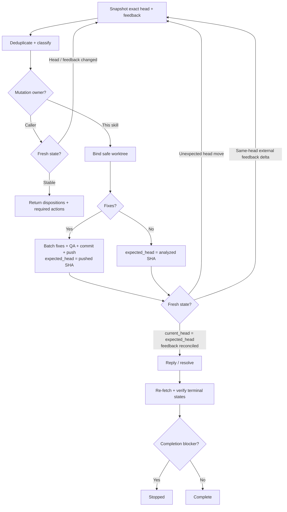

# PR Feedback Triage

Triage all current PR feedback against one exact head SHA. Remain usable standalone or as the feedback-analysis component of a larger PR loop.

## Ownership

- Bind every decision to the exact PR head SHA and feedback snapshot used to make it.
- If the caller owns repository or GitHub mutations, return validated dispositions and required actions without mutating state.
- Otherwise apply the focused fixes and GitHub actions needed to finish triage.
- Keep changes scoped to review feedback. Apply KISS, DRY, and YAGNI and preserve unrelated local work.

## Snapshot

Collect the exact head repository/ref/SHA and all current inline threads/comments, PR-level comments, review submissions/bodies, and user-supplied copied feedback. Paginate platform reads and preserve source IDs.

Split artifacts containing independent findings into stable item-scoped records while retaining the parent source ID. Merge only the same root cause; prefer inline context over duplicate bot summaries.

## Dispositions

Return one validated disposition per distinct feedback item:

- `fix`: smallest concrete edit and verification;
- `already addressed`: brief current-code evidence;
- `outdated`: brief evidence that it no longer applies;
- `answer`: concise answer with no code change;
- `clarify`: one focused question, left open;
- `defer` / `won't fix`: reason plus `decision_terminal: true|false`.

Retain source IDs and mark each source `resolve`, `leave_open`, or `not_resolvable`. Resolve a parent thread only when every contributing item is resolve-eligible.

## Flow

## Execution Rules

- Before returning caller-owned analysis, re-fetch the head and feedback; restart triage if either changed externally.
- Treat this run's validated fix push as an expected head transition by updating `expected_head`; restart only for another/unexpected head change.
- Before any reply or resolution require `current_head == expected_head`; ancestry is insufficient. After a fix push, revalidate prepared dispositions/actions against `expected_head` and refresh triage if any no longer holds. Refresh triage first on same-head external feedback changes.
- Batch all fixes from one snapshot into one coherent change, QA once, commit once, and push once. Never publish unrelated work or a partial conflicting batch.
- Keep replies to one sentence by default and prefer resolve-only for self-evident fixes, already-addressed items, and outdated items.
- Re-fetch threads after acting; retry an expected resolution once when safe, otherwise record `failed_action`.
- Resolve `defer` / `won't fix` only when `decision_terminal: true`; `clarify` and non-terminal decisions remain open.
- Treat an active unsuperseded `CHANGES_REQUESTED` review as `awaiting_re_review`. Do not dismiss it; a later `COMMENTED` review does not clear it.

## Terminal States

The mutation owner tracks executed sources as `resolved`, `replied_left_open`, `not_resolvable`, `awaiting_re_review`, or `failed_action`.

`replied_left_open` is terminal only when its disposition is terminal. Completion is blocked by unpublished fixes, missing clarification, non-terminal defer/won't-fix decisions, `awaiting_re_review`, failed actions, unresolved QA, or unreconciled head/feedback changes.

## Output

Report the analyzed head SHA, disposition counts, required or executed actions, verification when performed, remaining blockers, and terminal-state counts when mutations were executed.
