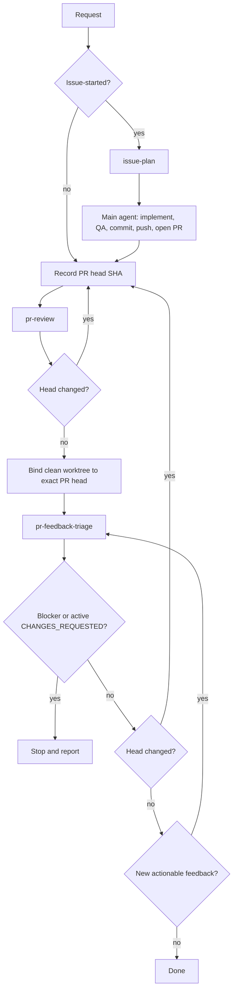

# PR Loop

Orchestrate an Issue-to-PR or PR review/fix loop by composing the repository's existing skills. This skill owns sequencing only; do not duplicate planning, review, subagent, posting, or feedback-triage logic here.

- [`issue-plan`](../issue-plan/SKILL.md) produces the advisory implementation plan for Issue-started work.
- [`pr-review`](../pr-review/SKILL.md) independently reviews one exact PR head and owns review strategy, validation, publication, and review-specific subagent contracts.
- [`pr-feedback-triage`](../pr-feedback-triage/SKILL.md) owns feedback collection, dispositions, focused fixes, verification, publication gates, replies, and thread resolution.
- The top-level main agent owns Issue implementation, repository QA, branch/commit/push, and opening the initial PR.

Treat every composed skill's output as advisory except for platform mutations that the skill explicitly owns. Validate advice against the current repository, requested scope, and exact PR before acting.

## Caller constraints

Preserve explicit caller constraints such as `dry_run`, `no_push`, and `no_reply` throughout the loop and pass their semantics to the composed skills. Translate only naming differences required by a child skill: `dry_run` or `no_reply` requires `pr-review`'s no-post behavior. Do not invent additional restrictions or report suppressed work as completed.

When review publication is suppressed, retain `pr-review`'s returned arbitrated findings and pass them to `pr-feedback-triage` as copied/local feedback bound to the reviewed head. Do not rely only on GitHub's current feedback, because unpublished findings must still be triaged and fixed when the active mode permits implementation.

For Issue-started work, `dry_run` stops after planning and analysis, while `no_push` may produce verified local commits but cannot enter a remote PR loop because no PR is opened.

## Workflow

## Issue-started flow

1. Resolve the requested Issue or same-repository Issue set and run `issue-plan`.
2. If planning returns `STATUS: blocked`, stop and report the smallest missing decision. Otherwise validate the ready plan against the requested Issue scope.
3. Unless prevented by the caller's mode, create a clean branch from the intended base, implement the plan directly in the main agent, and run the repository's normal QA.
4. Commit the scoped change. Unless `no_push` or `dry_run` prevents it, push the branch and open the pull request using normal repository conventions.
5. Enter the PR loop below. If no remote PR was opened, report the local state and stop.

For an existing-PR request, skip Issue planning and enter the PR loop directly.

## PR loop

Honor an explicit caller iteration limit; otherwise do not invent one. Track two bounded counters: increment `review_round_count` for every `pr-review` invocation, and increment `same_head_feedback_refresh_count` only when new feedback causes `pr-feedback-triage` to run again on an unchanged head. Reset only the feedback-refresh counter when the head changes. If the caller supplies a limit, apply it independently to both counters and stop before the next invocation that would exceed it.

1. Resolve the exact open pull request and record its head repository, head ref, and current head SHA.
2. Run `pr-review` for that pull request and increment `review_round_count`. Its returned reviewed head is the only head for which that review result is valid.
3. Re-fetch the PR head. If it differs from the reviewed head, discard head-scoped conclusions, reset `same_head_feedback_refresh_count`, and review the new head from step 1.
4. Before a `pr-feedback-triage` invocation that may edit code, verify that the local worktree can be safely bound to the recorded PR head repository/ref and exact SHA without mixing unrelated tracked changes or unpushed commits. Prepare that exact-head worktree when safe; otherwise stop before editing. `dry_run` may inspect without preparing a mutating worktree.
5. Run `pr-feedback-triage` against all current feedback plus any unpublished local findings retained from `pr-review`, preserving caller modes and scope.
6. If triage reports a blocker that needs user, reviewer, permission, publication, or QA intervention, stop and report it rather than fabricating progress.
7. Re-fetch the PR head after triage:
   - If the head changed, whether from this loop or externally, reset `same_head_feedback_refresh_count` and restart at step 1 to review the new head.
   - If the head is unchanged, re-fetch current feedback. If new actionable feedback appeared after triage, increment `same_head_feedback_refresh_count` and run `pr-feedback-triage` again on the same head without repeating `pr-review`.
   - If the head is unchanged and no actionable feedback remains, verify that no active, unsuperseded `CHANGES_REQUESTED` review remains. A later `COMMENTED` review alone does not clear that persisted reviewer state. If one remains, stop as awaiting re-review; do not dismiss or otherwise mutate reviewer state to manufacture completion. Otherwise finish.

Do not reuse review or triage advice after observing a head change. Do not repeat `pr-review` merely because feedback changed while the reviewed head stayed unchanged; `pr-feedback-triage` owns feedback-only refreshes and their mutation safety.

## Stop conditions

Stop and report the current state when any composed skill reports `unsupported`, when the local worktree cannot be safely bound to the exact PR head without mixing unrelated work, when required GitHub permissions or publication fail, when repository QA fails and cannot be resolved in scope, when feedback requires unresolved human input, when an active unsuperseded `CHANGES_REQUESTED` review is awaiting re-review, or when the caller's explicit iteration limit is reached.

A caller mode that intentionally suppresses push, posting, replies, or resolution is not a successful full loop. Report the suppressed work explicitly.

## Result

Return a concise summary containing:

- the Issue set when applicable and final PR;
- the final reviewed head SHA and number of review rounds;
- fixes and verification performed;
- any work suppressed by caller mode; and
- remaining blocker or confirmation that no actionable feedback and no active unsuperseded `CHANGES_REQUESTED` review remain on the unchanged final head.
