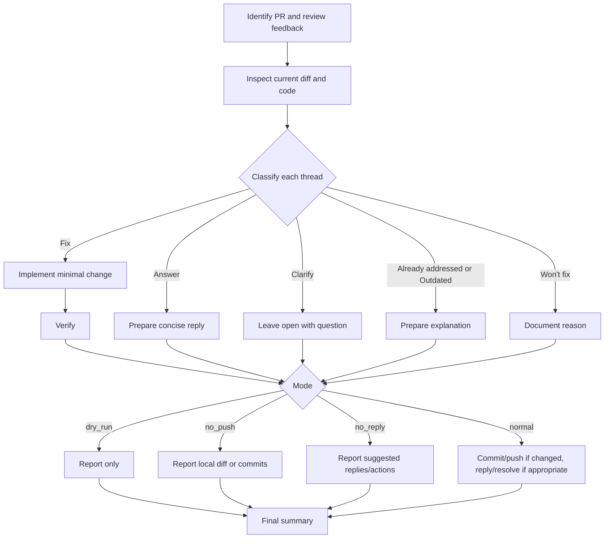

# PR Review Comment Triage

Triage pull request review feedback, decide what action each thread needs, make focused fixes when allowed, and report or resolve only what is actually handled.

## When to Use

- A PR has review comments, requested changes, or unresolved review threads.
- The user asks to address, respond to, or resolve PR feedback.
- The user provides a PR URL/number, a branch with an associated PR, or copied comments.

Do not use this skill for a first-pass code review with no existing feedback; use a code review skill instead.

## Inputs

- Pull request URL or number, or a current branch that has an associated pull request.
- Repository checkout or platform access sufficient to inspect the PR diff and review feedback.
- Optional reviewer priorities from the user, such as "only address blocking comments" or "do not reply on the PR platform".
- Optional operating mode flags: `dry_run`, `no_push`, and `no_reply`.

If no PR or review comments are identifiable, ask for the target PR or the copied comments before proceeding.

## Modes

- `dry_run`: inspect review feedback and report the triage only. Do not edit files, run write-mode formatters, commit, push, post replies, or resolve review threads.
- `no_push`: local edits and verification are allowed, but do not push commits or otherwise update the remote branch. Report the local diff or local commits that still need to be pushed.
- `no_reply`: do not post replies, submit reviews, or resolve review threads. Provide suggested replies and resolution actions in the final report instead.

When a mode disables an action, skip that destructive or externally visible action even if normal workflow text would otherwise allow it.

## Flow

## Compact Workflow

1. **Collect all relevant feedback**
   - Identify the PR and gather unresolved review threads, requested-change reviews, and copied comments.
   - Use platform-native APIs/CLI when available. Paginate results; do not inspect only the first page of threads or comments.
   - Compare each comment with the current diff and file contents because review lines can become outdated.

2. **Classify each thread/comment**
   - **Fix**: Valid requested change; make the smallest focused edit when not in `dry_run`.
   - **Answer**: No code change needed; prepare a concise explanation.
   - **Clarify**: Ambiguous, conflicting, or missing context; leave open with a question.
   - **Already addressed**: Current code already satisfies it; prepare evidence.
   - **Outdated**: Commented code or issue no longer exists; prepare evidence.
   - **Won't fix**: Valid concern intentionally not changed; document the reason.

3. **Act according to the classification and mode**
   - Keep edits scoped to the review feedback.
   - In `dry_run`, stop at triage, proposed fixes, suggested replies, and verification plan.
   - In `no_push`, local edits are allowed, but do not push or resolve threads for local-only fixes.
   - In `no_reply`, do not post replies or resolve threads; report suggested replies/actions instead.

4. **Verify before claiming completion**
   - For fixes, run appropriate checks or explain why they could not run.
   - Re-inspect the updated diff and comment context to confirm the concern is resolved.
   - Do not mark a thread resolved if it still needs reviewer, maintainer, or product input.

5. **Finish**
   - Normal mode: commit/push changes when appropriate, then reply and resolve only threads that are actually handled.
   - Safe modes: report the local state and the exact replies/resolution actions a human could take.

## Final Summary Checklist

- Mode used: `normal`, `dry_run`, `no_push`, or `no_reply`
- Counts by disposition: fixed, answered, clarified/left open, already addressed, outdated, won't fix
- Verification run or planned
- Commits pushed, local diff/commits, or "none"
- Remaining open items and who needs to respond
